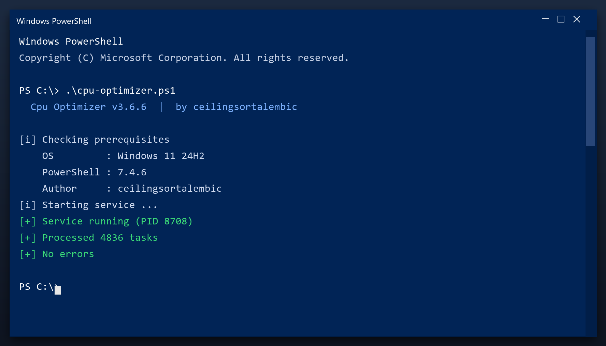

# Cpu Optimizer — Free 2026 Download

  

**At a glance**

| | |
| --- | --- |
| **Program** | Cpu Optimizer |
| **Version** | Latest 2026 build |
| **Price** | Free |
| **Systems** | see requirements below |
| **Download** | Quick Start section below |

---

If your PC feels slower than it used to, **cpu optimizer** is the fix. It clears the clutter that builds up over months of use and restores the speed you had on day one. Current 2026 build for Windows 10 and 11.

  

## 1. Overview

Cpu optimizer does three things: it finds junk files, it finds broken settings, and it removes them. That is the whole tool - no social features, no accounts, no ads. It runs as a normal Windows program and works fully offline after you download it.

| **Term** | **Meaning** |
| --- | --- |
| **Junk** | Files no program needs any more |
| **Broken entry** | A setting that points to nothing |
| **Cache** | Temporary data stored for speed |
| **Offline** | Works without an internet connection |

## 2. Technical Details

| **Feature** | **Details** |
| --- | --- |
| **Interface** | Single window, no clutter |
| **Learning curve** | None - obvious buttons |
| **Languages** | English |
| **Permissions** | Admin for some tasks |
| **Conflicts** | None with other tools |
| **Uninstall** | Clean, leaves nothing behind |

## 3. System Requirements

| **Component** | **Requirement** |
| --- | --- |
| **Operating system** | Windows 10 or 11 (64-bit) |
| **RAM** | 2 GB or more |
| **Free disk space** | 100 MB |
| **Permissions** | Administrator (for some tasks) |

## 4. Installation

1. **Grab the file** using the green button
2. **Extract** it to a folder of your choice
3. **Run** the tool (as admin for full access)
4. **Read** the scan report
5. **Apply** the fixes and reboot

  

> **Note:** this tool changes system settings, so antivirus software may be cautious. Add an exclusion if needed - the build on this page is tested.

## 5. What's Included

| **Component** | **Details** |
| --- | --- |
| **Main tool** | Latest 2026 build |
| **Guide** | Step-by-step setup |
| **FAQ** | Common questions |
| **Support** | Via the issues section |

## 6. Comparison

| **Feature** | **Other free tools** | **cpu optimizer** |
| --- | --- | --- |
| **Bundled adware** | Often | Never |
| **Accounts** | Sometimes | Not needed |
| **Telemetry** | Often on | Off |
| **Cost** | Free with upsells | Free |

## 7. Common Issues

| **Issue** | **Fix** |
| --- | --- |
| **Windows warns about the file** | Click More info, then Run anyway |
| **Slow first launch** | Normal - it indexes on first run |
| **Scan finds nothing** | Good - your PC is already clean |
| **Settings do not save** | Run as admin once so it can write config |

## 8. Maintenance Tips

- Empty the Recycle Bin first for a clearer picture
- Uninstall programs you no longer use before scanning
- Close browsers so their caches can be cleared
- Save your work before a full cleanup
- Reboot once the cleanup is done

## 9. Frequently Asked Questions

**Is admin access required?**

For a full cleanup, yes. Without it the tool only cleans your user folders.

**Will it fix my registry?**

It can scan and repair broken entries, and it backs up before changing anything.

**Does it work offline?**

Yes - once downloaded it needs no internet connection.

**How much space will I save?**

It varies, but most PCs recover several gigabytes on the first run.

---

*hyper-wren-372 · Updated 2026-10-09 · Shared under the MIT License*
